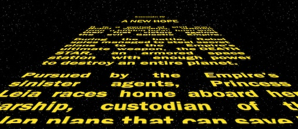

# HTML & CSS

*February 2019*

> 🔨  CSS learning in pair coding. The aim was to make an intro using "Star Wars style" 

* * *

# Ta ta ta tata, ta ta ta tata, ta ta ta taToh, Ta ta ta taaaaa !

## L'exercice
- Temps imparti : 1 jour
- Par groupe de deux

## Objectifs

- Connaître plus de propriétés CSS
- Améliorer ses compétences en positionnement CSS
- Apprendre les bases de l'animation en CSS

## Instructions

En pair-coding (groupe de deux), réaliser l'introduction de Star Wars en HTML et CSS.  
Voici une [vidéo d'exemple](https://www.youtube.com/watch?v=C587lNBQXAw).
Dans un premier temps on va juste faire défiler le texte.

- Faire un nouveau projet sur GitHub nommé **"Star Wars Crawl"**
- Créer un fichier `index.html`
- Créer un fichier `style.css`
- Utiliser un '[lorem ipsum](http://fr.lipsum.com/)' pour avoir du faux texte *([astuce](http://www.macdrifter.com/2012/09/lorem-ipsum-shortcut-in-sublime-text.html))*
- Positioner le conteneur du texte au centre de la page
- Faire incliner le conteneur en perspective *(astuce: rotation 3D)*
- Le faire défiler vers l'infini et au delà *(astuce: animation, @keyframe, transform, translate3D)*
- Personnaliser le texte pour raconter ton aventure chez BeCode ou, si tu préfères, mettre le texte du cadavre exquis
- Mettre en ligne grâce à [GitHub Pages](https://help.github.com/articles/configuring-a-publishing-source-for-github-pages/)

## Objectifs Bonus (aka À Devenir CSS Jedi tu chercheras)

- Ajouter un fond étoilé
- Ajouter le texte bleu d'introduction **"A long time ago.."**
- Ajouter le logo BeCode à la place de celui de Star Wars
- Ajouter de la musique grâce au tag `<audio>` (on vous rappelle qu'il est illégal de mettre une musique sous copyright sur votre site :) )
- **Extra extra bonus pour les ultras motivés:** Transformer votre afficheur d'introduction Star Wars en générateur d'introduction Star Wars. Afficher un bouton "Edit" dans un coin de la page. Quand on clique sur ce bouton cela ouvre une modale permettant d'éditer le texte. Un fois que le texte a été édité générer une URL contenant le texte à afficher en hash. Lorsqu'on ouvre cette URL le nouveau texte doit s'afficher.

## Ressources

- [Centrer un élément sur une page](https://www.w3schools.com/css/css_align.asp)
- [CSS3 Animations](https://www.w3schools.com/css/css3_animations.asp)
- [CSS3 Transformations](https://www.w3schools.com/css/css3_3dtransforms.asp)
- [CSS Animation for Beginners](https://robots.thoughtbot.com/css-animation-for-beginners)
- [Musique](https://www.w3schools.com/tags/tag_audio.asp)
